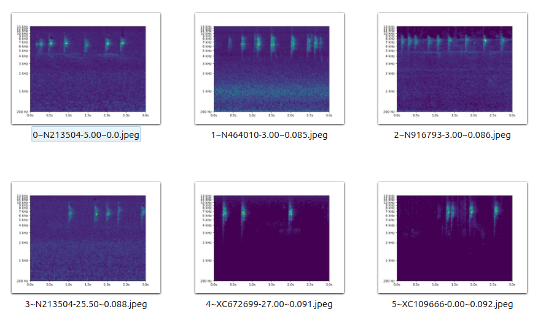
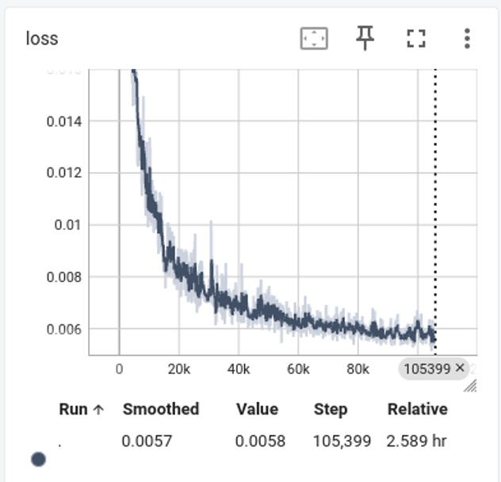
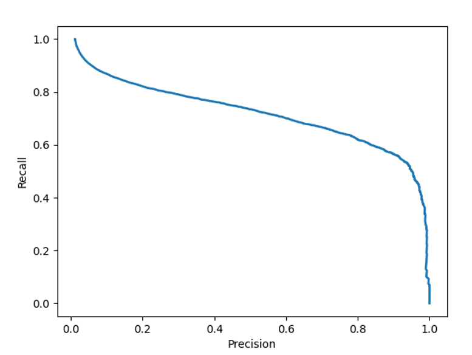

## How to Create Your Own Classifier Using HawkEars

### Introduction
You can use HawkEars to create your own classifier, for example to identify birds in your region. The steps are as follows:

1. Select classes to include in your model
2. For each class
   1. Collect recordings
   2. Create a database of all spectrograms from recordings
   3. Remove any duplicate recordings
   4. Select spectrograms to use in training
3. Train the model

### Selecting Classes to Include in Your Model

The first step is to identify the primary classes, such as a list of regional bird species. At least two secondary classes, Noise and Other, should be added to this list, where Noise contains wind sounds and rain, and Other contains sounds such as human voices, farm animals, traffic sounds, etc. For a bird classifier, you might also want classes for regionally common amphibian or mammal species, so that their sounds are not misidentified as birds.

During training, the data augmentation process checks for a class called Noise and treats it specially, so it is important to use that name. The name of the Other class is not important though.

### Collecting Recordings

Here are some public sources of recordings that can be used to populate your training dataset:

| Source    | Contents    | Comments    |
|-------------|-------------|-------------|
| [Xeno-Canto](https://xeno-canto.org/)  | birds, amphibians and more  | public API supports downloads  |
| [iNaturalist](https://www.inaturalist.org/)  | birds, amphibians and more  | public API supports downloads |
| [Macaulay Library](https://www.macaulaylibrary.org/)  | birds, amphibians and more  | no public API for downloads |
| [Google Audioset](https://research.google.com/audioset/)  | 632 classes, including cars, trains, voices, dogs, etc. | dataset can be downloaded  |
| [ESC-50](https://github.com/karolpiczak/ESC-50)  | 50 classes, including wind, rain, dogs, cows, etc. | dataset can be downloaded |
| [UrbanSound8K](https://urbansounddataset.weebly.com/urbansound8k.html)  | 10 classes including dogs, sirens, idling engines, etc. | dataset can be downloaded |

The HawkEars/tools directory contains scripts xeno.py and inat.py for downloading from Xeno-Canto and iNaturalist respectively. To see a list of arguments for a script, run it with the -h argument, like this:
```
python xeno.py -h
```
To download up to 500 American Robin recordings from Xeno-Canto to directory ~/data/AMRO, type the following in the tools directory:
```
python xeno.py --name "American Robin" --dir ~/data/AMRO --max 500
```
When using inat.py to download from iNaturalist, be sure to use scientific names, not common names. For example, type "dryophytes versicolor" instead of "Gray Treefrog". The iNaturalist API does not do exact matching, so a search for "Gray Treefrog" will include results for "Cope’s Gray Treefrog", but specifying "dryophytes versicolor" will return only recordings that match the requested species.

For Xeno-Canto, you can use the recording number in the URL to see the corresponding observation with comments and other details. For example, https://xeno-canto.org/123456 shows recording number 123456. For iNaturalist, recording numbers do not match observation numbers or URLs, but the inat.py script creates an inat.csv file with the mapping in the output directory.

### Creating a Database of all Spectrograms

Once you have created a directory of recordings for a class, you need to extract the spectrograms into a database. In this step we use the extract_all.py script to extract all the spectrograms. The important arguments are:

| Argument | Default | Description |
|-------------|-------------|-------------|
| --code | None | Species code (abbreviated name). |
| --db | None | Database name. A SQLite database file called "HawkEars/data/<db_name>.db" will be created. |
| --dir | None | Directory path containing recordings. |
| --name | None | Species name. |
| --offset | 1.5 | Create a 3-second spectrogram at offsets of this many seconds per recording. By default, spectrograms will be created at offsets 0, 1.5, 3.0, 4.5 etc. If you specify --offset 3, only half as many spectrograms will be created, at offsets 0, 3, 6, etc. |

After running this, you can use an open source application called [DB Browser for SQLite](https://sqlitebrowser.org/) to open the database file and browse the database.

### Removing Duplicate Recordings

It is common to find that the same recording has been uploaded more than once to a site such as Xeno-Canto, iNaturalist or Macaulay Library, or that it has been uploaded to multiple sites. Therefore it is useful to remove duplicate recordings before selecting your training data.

This step and the next one both make use of "embeddings". In this context an embedding is a relatively small 1-dimensional representation of a 2-dimensional image, generated by a deep learning model. Embeddings encode relevant features but not irrelevant features, such as small horizontal shifts in the case of spectrograms. As a result, the distance between embeddings is a useful measure of image similarity.

The first step is to populate your newly created database with an embedding per spectrogram. The embeddings are used to detect duplicates and to search for spectrograms later. Insert embeddings as follows:
```
python embed.py --db <database name>
```
Then you can list duplicates as follows:
```
python find_dup_recordings.py --db <database name> --name <class name>
```
To remove the duplicate recordings, re-run the script with the "--mode 1" argument.

### Selecting Spectrograms for Use in Training

In this phase you will populate a training database with selected spectrograms. For each class, repeat the following steps until you feel you have enough good spectrograms, or are no longer able to find new ones:

1. Find a good example of a sound type for the class
2. Search the class database for similar spectrograms
3. Review the matches, deleting any bad matches
4. Copy the remaining ones to the training database

If you have very little data for a class, you can just plot all the spectrograms in the class database, using tools/plot_from_db.py, rather than using the search method described below.

A program such as Audacity is helpful in this phase. Audacity lets you review a recording’s spectrogram, listen to a selected segment, and apply edits such as low-pass or high-pass filters. For example, you may find a good 3-second example, except that it has a lot of high-frequency noise. In that case you can save the segment in a separate audio file and apply a low-pass filter to remove the noise before searching for similar spectrograms in the class database.

Using your audio program of choice, examine your recordings to find a spectrogram to use as the basis for selecting further training spectrograms of that type. Once you have a good example, use the search.py script to find similar spectrograms in the database created above. The main arguments for search.py are:

| Argument | Default | Description |
|-------------|-------------|-------------|
| --db | None | Name of database to search. |
| --dist | .5 | Do not show matches with a cosine distance greater than this. |
| --name | None | Name of class to search. |
| --num | 200 | Maximum number of spectrograms to plot. |
| --inp | None | Path to recording containing selected example segment to search for. |
| --offset | 0 | Start time in seconds within the recording of selected example segment to search for. |
| --omit | None | A second database name, e.g. "training". Do not plot spectrograms that already exist in this database. |
| --out | output | Output directory, which will contain matching spectrograms. |

After running search, the output directory will contain images of matching spectrograms, as in this example:



The second image name above is 1\~N464010-3.00~0.085.jpeg. The first 1 indicates that it is the closest match (the one starting with 0 is the spectrogram we are searching for). The N464010-3.00 indicates that it is 3 seconds into recording N464010, and the final 0.085 is the cosine distance.

Next you should scan the output images, deleting any that clearly contain secondary species, or are problematic in other ways.

Once that is done, you can use the extract_by_image.py script to insert spectrograms corresponding to the remaining images into the training database. Its main arguments are as follows:

| Argument | Default | Description |
|-------------|-------------|-------------|
| --code | None | Species code (abbreviated name). |
| --db | training | Name of training database. |
| --dir | None | Directory containing recordings. |
| --inp | None | Directory containing spectrogram images. |
| --name | None | Species name. |

### Training the Model

The training code reads from a “pickle” file, rather than reading the database directly. This improves training performance, and makes it easy to use a data subset, or merge data from different databases. To create a pickle file from your training database:

1. Create a classes file.
2. Run pickle_db.py.

The classes file is a text file (e.g. HawkEars/data/classes.txt), in which each non-comment line has the format “name,code” for a class. You can also include comment lines, which begin with a # character. For example:
```
# Amphibians
Northern Leopard Frog,FROG-LEOP

# Birds
American Robin,AMRO
Hermit Thrush,HETH
```
The main arguments for pickle_db.py are as follows:

| Argument | Default | Description |
|-------------|-------------|-------------|
| --db | training | Name of training database. |
| --classes | classes | Name of classes file in data directory. |
| --name | ../data/specs.pickle | Path to output file. |

After creating a pickle file, you need to define a training configuration within HawkEars/core/configs.py, as in the following example:
```
# Simple training configuration
@dataclass
class Train_All(base_config.BaseConfig):
    def __init__(self):
        self.misc.train_pickle = "data/specs.pickle"
        self.train.model_name = "custom_hgnet_2"
        self.train.num_epochs = 10

# map names to configurations
configs = {"base": base_config.BaseConfig,
           "all": Train_All}
```
This defines the training data (self.misc.train_pickle), model type (self.train.model_name) and number of epochs (self.train.num_epochs), which is all you need to run training. Model types and sizes can be viewed in HawkEars/models. The custom_hgnet_2 configuration is an hgnet_v2 model with about 1.6M parameters, as described in HawkEars/models/hget_v2.py. You can use any model name supported by [timm](https://github.com/huggingface/pytorch-image-models/), or any custom configuration from the HawkEars/models directory, using the “custom_xxx_y” convention as above.

Finally, you can train a model, by typing the following in the root HawkEars folder:
```
python train.py -c all
```
Note that “all” is the name we assigned the training configuration in configs.py above. Once training is complete, the output will be in HawkEars/logs/fold-0/version_x. The first training run will output to version_0, the second to version_1, etc. The checkpoints sub-directory will contain the generated models. By default, there will be one checkpoint for each of the last three epochs, since the save_last_n setting defaults to 3.

To view graphical summaries of a training run, type this command:
```
tensorboard --logdir logs/fold-0/version_0
```
That will display a localhost URL, which you can open in a browser to display graphs such as this:



Using the configuration above would train a new model from scratch. It is also easy to do transfer learning from a HawkEars model. Here is a configuration that does that, freezing the feature extractor so only the classifier head is trained:
```
class Transfer_Learning(base_config.BaseConfig):
    def __init__(self):
        self.misc.train_pickle = "data/specs.pickle"
        self.train.load_ckpt_path = "data/ckpt/hgnet1.ckpt"
        self.train.freeze_backbone = True
        self.train.num_epochs = 10
```
Specifying self.train.load_ckpt_path indicates that training should begin with a pretrained checkpoint (model). Setting freeze_backbone to true causes training to run much faster, since only the classifier head is trained. Also, if you have limited training data and domain shift is minimal, this may give you the best results. You can also set freeze_backbone to false, in which case the whole model is re-trained, but it is initialized with weights from HawkEars.

Review core/base_config.py to see all the additional settings you can use. For example, you can:

1. Specify k-fold cross-validation.
2. Change the learning rate and batch size.
3. Change the number of checkpoints that are saved.
4. Change data augmentation settings.
5. Change audio and spectrogram settings.

If you want to try different audio or spectrogram settings after you create your training database, you can change the settings in core/base_config.py and then run tools/reextract.py. It will populate a new database with spectrograms using the new settings, using the same recordings and offsets as specified in the original database. If you are doing transfer learning from the HawkEars models though, you should stick with the default audio and spectrogram settings.

### Using Your Trained Models
To use your trained models, simply copy the checkpoints to a suitable directory and run inference using analyze.py. When running analyze.py it will use the model(s) contained in the directory defined in the main_ckpt_folder parameter in core/base_config.py. One option is to backup the existing data/ckpt directory and then replace its contents with your newly created checkpoints. Alternatively, you can create a new directory, such as data/my-ckpt, and update the main_ckpt_folder parameter in core/base_config.py to point to your new directory.

To create an ensemble, simply copy multiple checkpoint files to your checkpoint directory. In that case, analyze.py will use the average score from all models. Make sure that all models were trained on the same class list though.

You may also need to edit data/ignore.txt, which lists classes that are ignored during inference.

### Testing Your Models
In HawkEars/testing, there are three scripts to generate metrics from test data:

| Script | For Use When |
|-------------|-------------|
| test_per_sound.py | Ground truth data is annotated to show individual sounds |
| test_per_minute.py | Ground truth data is annotated to show classes per minute |
| test_per_recording.py | Ground truth data is annotated to show classes per recording |

The most granular data is generated by test_per_sound.py. It requires an annotation CSV file with four columns:

| Column Name | Description |
|-------------|-------------|
| recording | Stem of the recording file name (e.g. XC10400 if it’s XC10400.mp3) |
| species | Class code |
| start_time | Start of the sound in seconds from the beginning of the recording |
| end_time | End of the sound in seconds from the beginning of the recording |

To use test_per_sound.py, create an annotations file, then run analyze.py on your test recordings with --min_score 0, --overlap 0, and --merge 0. Then run test_per_sound.py, which has the following main arguments:

| Argument | Default | Description |
|-------------|-------------|-------------|
| --annotations | None | Path to annotations CSV file |
| --recordings | None | Path to recordings directory |
| --input | None | Name of directory containing output labels from inference (assumed to be a sub-directory of recordings directory) |
| --output | None | Output directory for reporting |

The script will then output statistics to the console, and write a large number of reports and images (graphs) to the output directory. Many of the output file names have the suffix “annotated” or “trained”, indicating whether they include only the classes in the annotations, or all classes supported by the model. For example, here is a file called pr_curve_annotated.png from one test:



